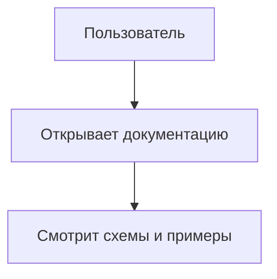

# Поддержка Mermaid в MkDocs Material

## Включение Mermaid через pymdownx.superfences

Добавьте в `mkdocs.yml`:

```yaml
markdown_extensions:
  - pymdownx.superfences:
      custom_fences:
        - name: mermaid
          class: mermaid
          format: !!python/name:pymdownx.superfences.fence_code_format
```

## Пример Mermaid-диаграммы


