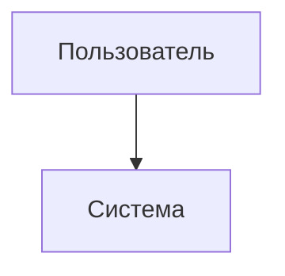

# Caption (подписи к изображениям и блокам)

## 1. Что такое caption
Caption — подпись к изображению, диаграмме или таблице, поясняющая содержание элемента.

В MkDocs Material caption реализуется расширением:

```yaml
markdown_extensions:
  - pymdownx.blocks.caption
```

---

## 2. Подпись к изображению

### Вариант 1 (простой)
```markdown


*Рисунок 1 — ER-диаграмма предметной области*
```
> Рисунки будут подписаны по левому краю и  жирным
### Вариант 2 (рекомендуемый)
```markdown


/// caption
Рисунок 1 — ER-диаграмма предметной области
///
```
> Рисунок и подпись будут выравнены по центру
---

## 3. Caption для Mermaid

````markdown

/// caption
Рисунок 1 — Пример подписи для mermaid
///
````

---

## 4. Caption для таблиц

```markdown 
Таблица 1 — Структура сущности «Пользователь»

| Поле | Тип |
|------|-----|
| id   | int |
```

> Таблица будет подписана по левому краю