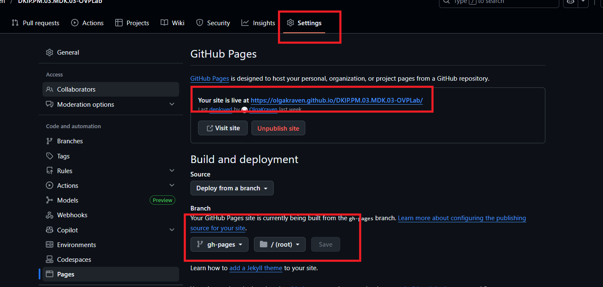

# Публикация MkDocs на GitHub Pages через `mkdocs gh-deploy --force`

## Назначение

Команда `mkdocs gh-deploy --force` используется для **принудительной публикации** сайта MkDocs на GitHub Pages.  
Она автоматически:

* собирает сайт (`mkdocs build`);
* создаёт/обновляет ветку публикации (`gh-pages`);
* отправляет сайт в репозиторий GitHub.

Используется, когда:

- требуется быстро опубликовать сайт без GitHub Actions;
- нужно пересобрать сайт и перезаписать содержимое ветки `gh-pages`;
- **GitHub Pages не обновляется после обычной публикации.**

---

## Предварительные требования

### 1. Установлены Python и MkDocs Material

```bash
pip install mkdocs-material
````

Если вы используете плагины, установите их тоже (пример):

```bash
pip install material-glightbox
```

### 2. Проект содержит `mkdocs.yml` и папку `docs/`

Пример:

```text
project-root/
├─ docs/
│  └─ index.md
└─ mkdocs.yml
```

### 3. Репозиторий Git настроен и связан с GitHub

Проверка:

```bash
git remote -v
```

---

## Шаг 1. Проверка локальной сборки (рекомендуется)

Перед публикацией убедитесь, что сайт собирается локально:

```bash
mkdocs build --clean
```

Если ошибок нет — можно публиковать.

---

## Шаг 2. Публикация на GitHub Pages (принудительно)

В корне проекта выполните:

```bash
mkdocs gh-deploy --force
```

### Что произойдёт после выполнения команды

* MkDocs соберёт сайт
* Ветка `gh-pages` будет **перезаписана**
* GitHub получит обновлённую версию сайта

---

## Шаг 3. Настройка GitHub Pages в репозитории

1. Откройте репозиторий на GitHub
2. Перейдите: **Settings → Pages**
3. В разделе **Build and deployment** укажите:

   * **Source:** `Deploy from a branch`
   * **Branch:** `gh-pages`
   * **Folder:** `/ (root)`
4. Сохраните настройки


/// caption
Рисунок 1 — Настройка GitHub Pages в репозитории
///
---

## Шаг 4. Проверка результата

Ссылка на сайт появится в:

* **Settings → Pages**
* или в блоке About (если добавлен Website)

Формат ссылки обычно:

```text
https://USER.github.io/REPOSITORY/
```


/// caption
Рисунок 2 — Проверка результатов
///

---

## Важные замечания

### 1) `--force` перезаписывает публикацию

Флаг `--force` **удаляет старое содержимое ветки `gh-pages`** и публикует заново.
Это нормально для учебных проектов, но важно понимать последствия.

### 2) Если сайт открывается, но изменения не видны

* сделайте жёсткую перезагрузку браузера:

  * Windows: `Ctrl + F5`
  * macOS: `Cmd + Shift + R`

### 3) Если репозиторий приватный

GitHub Pages может требовать платный план или ограничивать публикацию (зависит от настроек организации/аккаунта).

---

## Типовые ошибки и решения

### Ошибка: `remote: Permission denied`

Причина: нет прав на репозиторий или не выполнен вход.
Решение:

* авторизоваться в GitHub CLI или заново настроить доступ;
* проверить `git remote -v`.

### Ошибка: `mkdocs: command not found`

Причина: MkDocs не установлен в текущем окружении.
Решение:

```bash
python -m pip install mkdocs mkdocs-material
```

### Ошибка: некорректные ссылки/ресурсы

Проверьте, что пути к изображениям и файлам идут из `docs/`, например:

```markdown

```

и файл реально лежит:

```text
docs/assets/images/schema.png
```
